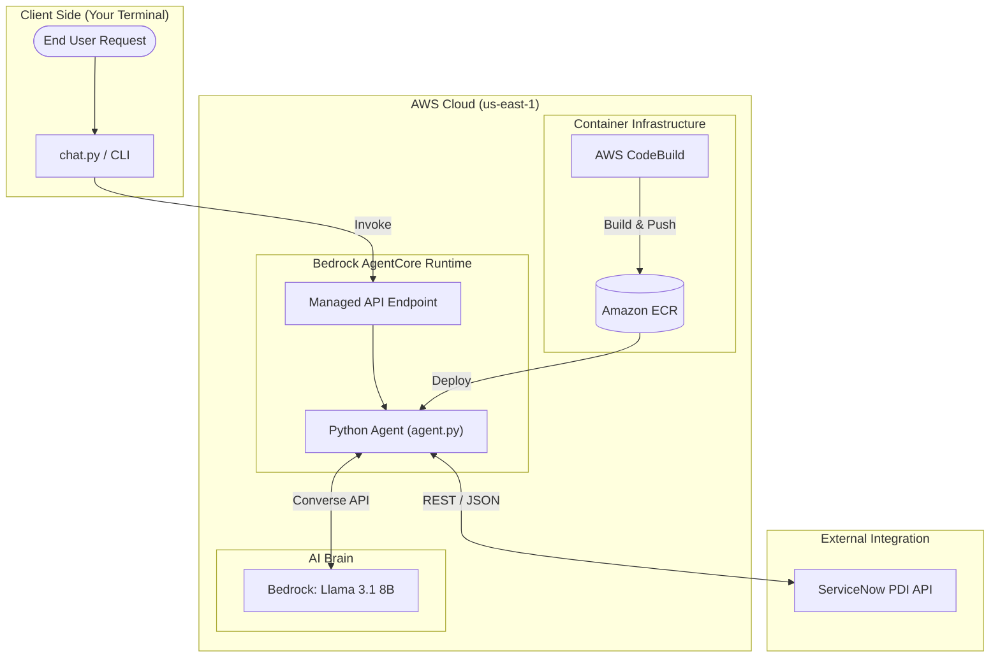

# 🚀 ServiceNow AI Assistant: Project Documentation

This document provides a complete overview of the **snassist** project, which integrates a ServiceNow Personal Developer Instance (PDI) with an AI agent deployed on **AWS Bedrock AgentCore**.

---

## 🏛️ 1. Architecture Overview

Your agent is a **Serverless, Containerized AI Agent**. It uses a "brain" in the cloud (Llama 3.1) and "hands" (Python code) to interact with your ServiceNow data.

---

## 📁 2. File Directory Guide

| File | Purpose |
| :--- | :--- |
| **`agent.py`** | The **"Brain Logic"**. Contains the FastAPI-like entrypoint, the tool definitions (List/Create Incidents), and the ServiceNow REST client. |
| **`chat.py`** | **"The User Interface"**. A clean Python helper script that allows you to chat with your cloud agent without typing complex JSON. |
| **`Dockerfile`** | **"The Blueprint"**. Instructions for building the Linux container. It uses a secure, ARM64-optimized Python image from the AWS Public ECR. |
| **`.bedrock_agentcore.yaml`** | **"The Map"**. The primary configuration for AWS. It tells AgentCore which model to use, which ECR repo to push to, and what the agent's unique ID is. |
| **`requirements.txt`** | **"The Recipes"**. Lists your Python dependencies: `boto3` (AWS), `httpx` (ServiceNow API), `python-dotenv`, and `bedrock-agentcore`. |
| **`.env`** | **"The Keys"**. Stores your sensitive ServiceNow credentials and AWS tokens. **Never share this file.** |
| **`.env.example`** | **"The Template"**. A blank version of `.env` you can share with others so they can set up their own credentials. |
| **`.gitignore`** | **"The Guard"**. Prevents sensitive files like `.env` and large folders like `venv/` from being accidentally committed to version control. |
| **`.dockerignore`** | **"The Filter"**. Ensures your cloud builds stay small and fast by ignoring local log files during deployment. |

---

## ☁️ 3. AWS Resources Created

When you ran `agentcore launch`, the following resources were provisioned in your **us-east-1** (N. Virginia) account:

1.  **Bedrock AgentCore Runtime**: A managed endpoint called `snassist-AXlQfeFnCu`. This is the single API gateway your code talks to.
2.  **ECR Repository**: `444353258201.dkr.ecr.us-east-1.amazonaws.com/bedrock-agentcore-servicenow-assistant`. This stores your container images.
3.  **CodeBuild Project**: `bedrock-agentcore-snassist-builder`. This builds your code into a Docker image automatically in the cloud.
4.  **S3 Bucket**: `bedrock-agentcore-codebuild-sources-...`. A temporary storage area for your code during the build process.
5.  **CloudWatch Log Group**: `/aws/bedrock-agentcore/runtimes/snassist-...`. This is where all the `print()` statements from your code go for debugging.

---

## 🔄 4. How it Flows (Request Cycle)

1.  **User Input**: You run `python chat.py "Help me with my laptop"`.
2.  **AWS Invocation**: The script sends the message to the **AgentCore Runtime** in AWS.
3.  **LLM Reasoning**: Your container receives the request and asks **Llama 3.1** what to do.
4.  **Tool Execution**: Llama says "Create an incident!". Your Python code makes a **REST API call** to ServiceNow.
5.  **Data Retrieval**: ServiceNow creates the ticket and sends a confirmation JSON back.
6.  **Summarization**: Llama looks at the ServiceNow JSON and outputs a friendly message: *"Success! I've logged INC00123 for you."*
7.  **Output**: You see the final response in your terminal.

---

## ⚡ 5. Status & Cleanup

*   **Check Status**: `agentcore status snassist`
*   **Update Code**: Edit your files and run `agentcore launch` again to redeploy.
*   **Total Cleanup**: `agentcore destroy` (This will delete all the AWS resources listed above).
